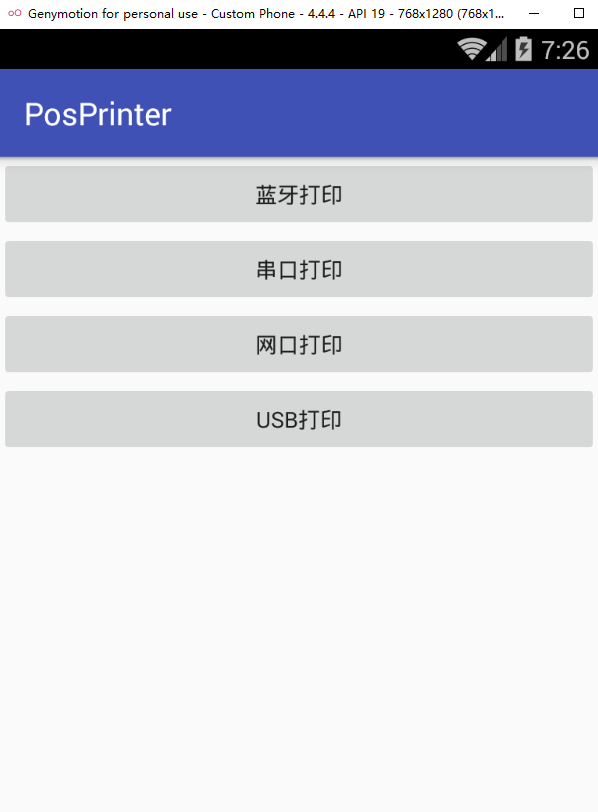

# 打印小票

打印的本质：1. 获取输出流；2. 向流中写入数据。  所以问题就是如何友好的实现这两步

## 蓝牙打印 --> 通信功能参考 BluetoothAssist 蓝牙调试助手

PosCmd --> 封装的是各种蓝牙指令（功能很纯粹，就仅仅是提供打印指令）

PrintUtils --> 把我们的待打印的源数据，使用 PosCmd 指令封装成要直接写给流的打印数据(byte[])

BluetoothChatService --> 职责： 蓝牙连接，通信 （功能很纯粹，就仅仅是提供通信功能）

Activity中依赖 PrintUtils 和 BluetoothChatService， 而 PrintUtils 又依赖于 PosCmd。

使用：我们在Activity中使用 PrintUtils 把源数据封装转换成byte[], 然后调用 BluetoothChatService 的write() 方法即可

## 串口打印 --> 通信功能参考 SerialPortAssist 串口调试助手

main/cpp 目录和 main/jni 目录功能是一样的。jni目录是之前的写法，现在AS中默认创建的是cpp目录，当然也可以创建jni目录

加入c/c++代码之后，要注意 CMakeLists.txt 的编写以及 app/build.gradle 的配置， 然后编译之后，就可以看到 app/build/intermediates/cmake/debug/obj/arm64-v8a/libserial_port.so

## 网口打印
使用socket来获取流操作。

    Socket socket = new Socket(host, port);
    OutputStream outputStream = socket.getOutputStream();

    //打印数据
    byte[] printData = PrintUtils.generateBillData("123456", "0.5");
    outputStream.write(printData);

## USB打印

https://developer.android.google.cn/guide/topics/connectivity/usb/host.html (可以搜搜翻译)
http://blog.csdn.net/qiwenmingshiwo/article/details/50854688
http://blog.csdn.net/true100/article/details/51791929
http://blog.csdn.net/lincyang/article/details/50739342

#效果图：
